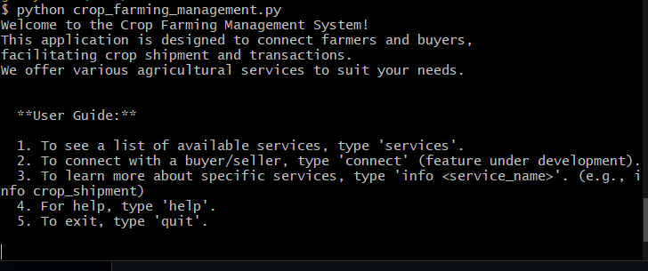

# Negpod21-Crop-Mgt-System

This application was created to help solve some of the issues in agriculture. A lot of farmers experience issues with crop storage and transportation which has lead to loss of crops and a negative impact on their finances.

# Key Features of the Application
The application starts with a welcome message that introduces the user to the platform, followed by the user guide.
The user guide contains a list of resources for easy navigation.

# Installation

1. Install python (python3 or python)

# The welcoming message will be:  

